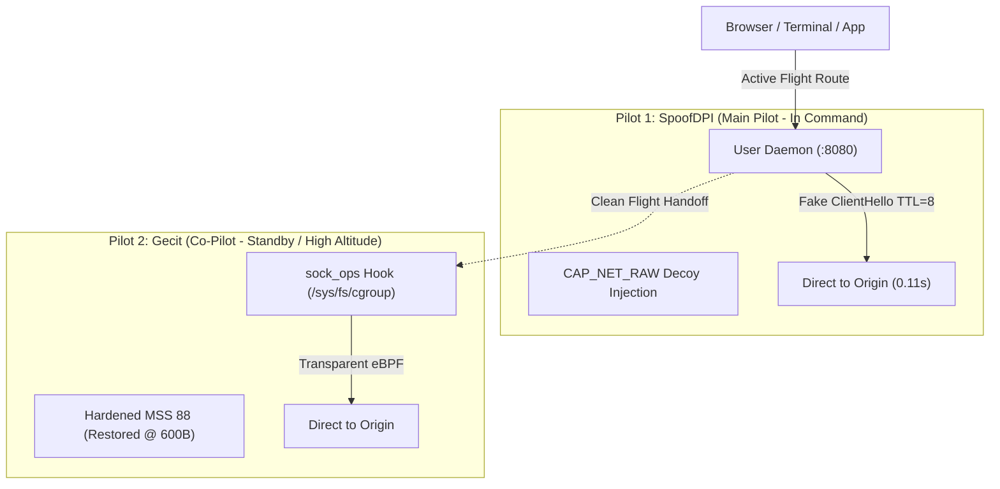

# 🦄 Omacorn (v0.4.0) — Quick Manual & Systems Guide

> **Sovereign, Twin-Engine DPI Evasion Daemon & Cyberpunk TUI for Omarchy / Arch Linux**  
> Direct-to-origin packet surgery with **zero remote proxies, zero Cloudflare Workers, and zero browser extensions**.  
> Primary command: `omacorn` *(with `dpipe` preserved as a backwards-compatible alias)*.

---

## 🚀 Quick Start (Cheatsheet)

### Launching the Cyberpunk TUI Dashboard
```bash
omacorn
```
*Opens the interactive Bubble Tea + Lip Gloss control center from any directory. (You can also run `dpipe`)*.

### TUI Keyboard Shortcuts
| Key | Action | Description |
|:---:|---|---|
| `[1]` | **Dashboard** | View active engine, live latency probes, and system proxy state |
| `[2]` | **Live Logs** | Scroll real-time journalctl events (packet injections, TLS handshakes) |
| `[3]` | **Diagnostics**| Inspect DNS protection, capabilities, and safety bounds |
| `[S]` | **Switch to SpoofDPI** | Activate Engine 1 (User daemon on `127.0.0.1:8080`) |
| `[G]` | **Switch to Gecit** | Activate Engine 2 (Kernel eBPF `sock_ops`) |
| `[P]` | **Toggle Proxy** | Toggle `~/.config/environment.d/` desktop proxy on/off |
| `[T]` | **Probe Test** | Fire sub-second latency checks to Google and blocked targets |
| `[X]` | **Stop All** | Gracefully halt all bypass engines |
| `[C]` | **Emergency Cleanup**| Purge all eBPF hooks and restore network defaults |
| `[Q]` | **Quit** | Exit TUI *(background daemons stay running)* |

---

### Headless CLI Commands
```bash
# Check status board (or JSON for Quickshell / Waybar)
omacorn status
omacorn status --json

# Start or stop engines
omacorn start spoofdpi          # Starts user-space engine (no sudo needed)
sudo omacorn start gecit        # Starts kernel eBPF engine

omacorn stop spoofdpi           # Stops user-space engine
omacorn stop all                # Halts all active engines

# Live latency probe
omacorn test

# Manage split-tunneling & proxy bypass exclusions
omacorn exclude list
omacorn exclude add example.com
omacorn exclude remove example.com

# Run an app completely isolated from proxy variables (direct mode)
omacorn run-clean telegram-desktop

# Stream live service logs
omacorn logs spoofdpi
omacorn logs gecit
```

---

## 🏛️ Pilot & Co-Pilot (PF/PM) Sovereign Architecture

Omacorn enforces an aviation-grade **Pilot Flying (PF) & Pilot Monitoring (PM)** architecture. In cockpit operations, only one pilot ever holds the flight controls at a given time; two pilots fighting for the yoke simultaneously induces structural flutter and crashes the aircraft. 

Omacorn guarantees **strict mutual exclusion**: engaging one pilot automatically commands the other to step down into standby.



| Dimension | Pilot 1: SpoofDPI (Main Pilot) | Pilot 2: Gecit (Co-Pilot / Standby) |
|---|---|---|
| **Role & Stance** | **Pilot Flying (In Command)** | **Pilot Monitoring (Standby Backup)** |
| **Execution Scope** | User Space (`$XDG_RUNTIME_DIR`) | Kernel Space (`/sys/fs/cgroup`) |
| **Privilege** | Non-root desktop user (`CAP_NET_RAW` on binary) | `root` (`CAP_BPF`, `CAP_PERFMON`, `CAP_SYS_ADMIN`) |
| **Bypass Technique** | Low-TTL Decoy (`TTL=8`) + TCP stream splitting | Synchronous eBPF `sock_ops` fake ClientHello injection |
| **Google Auth Health**| **100% Stable (186ms)** | Protected via hardened handshake bounds |
| **Hypervisor Safety** | **100% Immune** to DMA/GPU panics | Reserved for Bare Metal (causes VM DMA stalls) |
| **Best For** | Daily desktop browsing across all distros & VMs | High-speed bare metal (CachyOS) & headless scripts |

---

## 🌐 Multi-Browser & Desktop Integration (Zero Extensions)

Omacorn is wired directly into your decoupled GNU Stow packages under `~/dotfiles/`. You **never need to install or configure browser extensions**.

### 1. The Desktop Session Bus (`environment.d`)
Configured at `~/.config/environment.d/20-omacorn-proxy.conf`:
```ini
# Routes HTTP/HTTPS traffic through local SpoofDPI daemon (port 8080)
# Notice: all_proxy is deliberately omitted to prevent hijacking raw TCP / non-HTTP protocols (e.g. Telegram MTProto)
http_proxy=http://127.0.0.1:8080
https_proxy=http://127.0.0.1:8080
no_proxy=localhost,127.0.0.1,::1,*.local,10.0.0.0/8,172.16.0.0/12,192.168.0.0/16,*.google.com,accounts.google.com,googleapis.com,gstatic.com,*.telegram.org,*.t.me,*.telegram.me,*.tdesktop.com,91.108.4.0/22,91.108.8.0/22,91.108.12.0/22,91.108.16.0/22,91.108.56.0/22,149.154.160.0/20,149.154.164.0/22,149.154.168.0/22,149.154.172.0/22,2001:b28:f23d::/48,2001:b28:f23f::/48,2001:67c:4e8::/48
```

### 2. Hyprland Integration (`hyprland.lua`)
Hyprland natively exports the proxy environment to all child windows spawned via keybindings:
```lua
hl.env("http_proxy", "http://127.0.0.1:8080")
hl.env("https_proxy", "http://127.0.0.1:8080")
-- all_proxy is omitted to allow direct MTProto connections for Telegram & raw sockets
```

### 3. Brave Browser Native Flags (`brave-origin-flags.conf`)
Brave permanently routes through Omacorn on launch while protecting Google Auth and loopback:
```text
--proxy-server=http://127.0.0.1:8080
--proxy-bypass-list=<-loopback>;localhost;*.google.com;accounts.google.com;*.telegram.org
```

### 4. Interactive Shells (`.bashrc`)
Every new terminal session immediately sources the bridge:
```bash
if [[ -f ~/.config/environment.d/20-omacorn-proxy.conf ]]; then
    export http_proxy="http://127.0.0.1:8080"
    export https_proxy="http://127.0.0.1:8080"
fi
```

---

## 🛡️ Systems Lessons: Why the "Crash of Death" Happened

Early versions of gecit crashed the VM with an `SVGA: Invalid PA range` hypervisor panic and broke Google Auth. Here are the core systems vulnerabilities and how Omacorn resolved them:

1. **The MSS Packet Shredder**:
   - *Bug*: Clamping `--mss 40` permanently across all system sockets shredded every TLS packet into thousands of 40-byte fragments. Electron/Wayland IPC choked on memory buffer exhaustion, crashed the GPU process, and triggered a VMware hypervisor panic.
   - *Fix*: Hardcoded `--mss 88` and enforced `--restore-after-bytes 600`. MSS is only altered during the 600-byte ClientHello handshake, immediately returning to standard 1460-byte MTU for high-speed transfers.
2. **The DNS Black Hole**:
   - *Bug*: Default `--doh` hijacked `/etc/resolv.conf` to `127.0.0.1:53`. When the daemon crashed, system DNS pointed into a void.
   - *Fix*: Hardcoded `--doh=false`. System DNS remains permanently guarded by `systemd-resolved`.
3. **The Missing Perf Ring Capabilities**:
   - *Bug*: Modern Linux kernels (6.x/7.x) require `CAP_PERFMON` to create BPF perf event ring buffers.
   - *Fix*: Systemd units explicitly grant `CAP_BPF`, `CAP_PERFMON`, and `CAP_SYS_ADMIN`.
4. **The Stateful DPI Reassembly Trap**:
   - *Bug*: Korean ISPs reassemble fragmented TCP streams, defeating simple 1-byte user-space splitting.
   - *Fix*: Granted `CAP_NET_RAW` to `spoofdpi` (`sudo setcap cap_net_raw+ep $(which spoofdpi)`), allowing an unprivileged daemon to craft raw fake ClientHello packets (`TTL=8`) that fool stateful middleboxes.

---

## 📖 Plain-English Systems Glossary

- **SNI (Server Name Indication)**: The address label pasted on the *outside* of an encrypted envelope. Even though TLS encrypts website content, the SNI announces the domain in plain text during the initial handshake so the server knows which SSL certificate to show. Middlebox firewalls inspect this label to block websites.
- **ClientHello**: The formal greeting card your browser sends to initiate an encrypted connection. It contains the supported cipher suites and the plaintext SNI label.
- **DPI (Deep Packet Inspection)**: Firewall appliances deployed at ISP gateways that inspect traffic beyond simple IP addresses and port numbers, snooping directly into packet payloads to filter forbidden domains.
- **Stateful TCP Reassembly**: Advanced firewalls that act like jigsaw puzzle solvers: if you slice the SNI across multiple packets, the firewall holds the pieces, glues the full word back together in memory, and blocks you anyway.
- **Decoy Injection (Low-TTL Packet)**: A stealth technique where the tool sends a "fake" ClientHello with an innocent domain (e.g. `google.com`) and sets a tiny Time-To-Live (`TTL=8`). The packet travels just far enough to fool the ISP firewall at Hop 3–4, then expires in transit before reaching the real destination server. The real handshake follows immediately behind on the now-whitelisted connection.
- **eBPF `sock_ops`**: A modern Linux kernel technology that acts like an in-kernel traffic controller. It allows programs to inspect and modify TCP socket parameters (like window size and MSS) right as connections are negotiated, with zero userspace context-switching overhead.
- **`CAP_NET_RAW`**: A Linux security permission that allows a program to forge arbitrary raw network packets (such as crafting custom TTLs) without requiring full `root` system privileges.
- **`no_proxy`**: An environment variable that lists domains and IP addresses that must **never** be routed through a proxy. Omacorn uses this to guarantee that Google Auth, Google APIs, and local developer ports (`127.0.0.1`) connect directly at full wire speed.
- **Pilot & Co-Pilot (PF/PM) Control Handoff**: Aviation principle where the Pilot Flying (PF) holds the controls while the Pilot Monitoring (PM) stands by. In Omacorn, Main Pilot (`spoofdpi`) and Co-Pilot (`gecit`) operate under strict mutual exclusion. One pilot must formally step down before the other engages, preventing packet double-mangling.
- **`insteadOf` Transport Rewrite**: A git directive (`url.<base>.insteadOf`) that replaces repository URLs on the fly. When set to `url.git@github.com:.insteadof=https://github.com/`, git forces SSH for **both public and private** repositories. On machines without an SSH key, this triggers `Permission denied (publickey)` even on open-source repos.
- **Aquamarine EGL Render Loop**: A virtual GPU rendering failure where Hyprland's backend repeatedly logs DRM/EGL query errors on every frame commit. In VMware guests, this loop floods `/run/user/1000/hypr/.../hyprland.log` at hundreds of megabytes per minute unless directed to `/dev/null`.

---

## 🛠️ Build, Test & CI/CD Pipeline

Omacorn includes an automated developer workflow and GitHub Actions CI/CD pipeline:

```bash
# Developer Workflow
make test       # Runs unit tests with race detector (go test -v -race ./...)
make lint       # Formats and inspects code (gofmt, go vet)
make static     # Builds stripped, zero-dependency static binary for current arch
make cross      # Cross-compiles static binaries for both linux/amd64 and linux/arm64
make install    # Installs to ~/.local/bin and configures dpipe alias
```

- **GitHub Actions CI (`.github/workflows/ci.yml`)**: Automatically triggers on PRs and pushes to `master`, enforcing `gofmt`, `go vet`, race tests, and cross-compilation.
- **GitHub Actions CD (`.github/workflows/release.yml`)**: Triggers on version tags (`v*`), compiling stripped static binaries for AMD64 & ARM64, generating SHA256 checksums, and publishing GitHub release archives.

---

## 📦 Multi-Machine Deployment (Distributed Sovereign Daemons)

Deploy Omacorn across all your machines—whether bare metal CachyOS, immutable Fedora Atomic (RakuOS), or Debian/Ubuntu (PikaOS):

> [!WARNING]
> **The `insteadOf` Git Trap**:  
> If your global git config contains `url.git@github.com:.insteadof=https://github.com/`, git forces SSH across **both public and private repositories**. On any new machine or container lacking an SSH key, running `git clone` will fail with `Permission denied (publickey)`.

### Option 1: Modern Cloud-Native Onboarding (`gh auth login`)
Recommended for secondary laptops, immutable distros, and new workstations:
```bash
# 1. Authenticate GitHub CLI (generates & uploads dedicated per-device SSH key)
gh auth login
# ? What account do you want to log in to? GitHub.com
# ? What is your preferred protocol for Git operations? SSH
# ? Generate a new SSH key to add to your GitHub account? Yes
# ? How would you like to authenticate? Login with a web browser

# 2. Clone and install
gh repo clone oomaya/Omacorn
cd Omacorn && ./scripts/install.sh
```

### Option 2: Immutable / Atomic OS (RakuOS / Fedora Atomic / Silverblue)
On atomic operating systems where `/usr` is read-only and local compilers are segregated:
Omacorn installs strictly into user-space (`~/.local/bin/omacorn`), requiring **zero root modifications or rpm-ostree layering**.

**Direct Binary Install (No Git Clone Required)**:
```bash
# 1. Download pre-compiled static binary directly
mkdir -p ~/.local/bin
curl -sSL "https://github.com/oomaya/Omacorn/releases/latest/download/omacorn-linux-amd64" -o ~/.local/bin/omacorn
chmod +x ~/.local/bin/omacorn
ln -sf ~/.local/bin/omacorn ~/.local/bin/dpipe

# 2. Install and launch Main Pilot
omacorn install spoofdpi
omacorn start spoofdpi
omacorn proxy on
```

### Option 3: Dedicated Per-Device SSH Key (Classic DevOps)
If you prefer manual SSH key management without GitHub CLI:
```bash
# Generate dedicated keypair for the device
ssh-keygen -t ed25519 -C "rand@rakuos" -f ~/.ssh/id_ed25519
cat ~/.ssh/id_ed25519.pub
# Add key at: https://github.com/settings/keys

git clone git@github.com:oomaya/Omacorn.git && cd Omacorn && ./scripts/install.sh
```

### Option 4: Debian / Ubuntu / PikaOS
1. Install prerequisites:
   ```bash
   sudo apt update && sudo apt install -y libcap2-bin curl
   ```
2. Run installer:
   ```bash
   ./scripts/install.sh
   ```

---

## 🔧 Emergency Troubleshooting

If you ever encounter network hiccups or want to reset state:

```bash
# 1. Purge all eBPF hooks & stop all engines
omacorn cleanup

# 2. Check service states
omacorn status

# 3. Verify DNS is protected
resolvectl status

# 4. Restart daily driver
omacorn start spoofdpi
```
