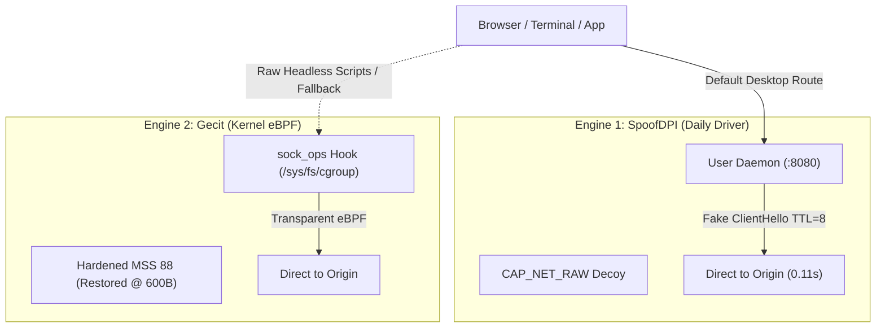

# 🦄 Omacorn (v0.3.0) — Quick Manual & Systems Guide

> **Sovereign, Twin-Engine DPI Evasion Daemon & Cyberpunk TUI for Omarchy / Arch Linux**  
> Direct-to-origin packet surgery with **zero remote proxies, zero Cloudflare Workers, and zero browser extensions**.  
> Primary command: `omacorn` *(with `dpipe` preserved as a backwards-compatible alias)*.

---

## 🚀 Quick Start (Cheatsheet)

### Launching the Cyberpunk TUI Dashboard
```bash
omacorn
```
*Opens the interactive Bubble Tea + Lip Gloss control center from any directory. (You can also run `dpipe`)*.

### TUI Keyboard Shortcuts
| Key | Action | Description |
|:---:|---|---|
| `[1]` | **Dashboard** | View active engine, live latency probes, and system proxy state |
| `[2]` | **Live Logs** | Scroll real-time journalctl events (packet injections, TLS handshakes) |
| `[3]` | **Diagnostics**| Inspect DNS protection, capabilities, and safety bounds |
| `[S]` | **Switch to SpoofDPI** | Activate Engine 1 (User daemon on `127.0.0.1:8080`) |
| `[G]` | **Switch to Gecit** | Activate Engine 2 (Kernel eBPF `sock_ops`) |
| `[P]` | **Toggle Proxy** | Toggle `~/.config/environment.d/` desktop proxy on/off |
| `[T]` | **Probe Test** | Fire sub-second latency checks to Google and blocked targets |
| `[X]` | **Stop All** | Gracefully halt all bypass engines |
| `[C]` | **Emergency Cleanup**| Purge all eBPF hooks and restore network defaults |
| `[Q]` | **Quit** | Exit TUI *(background daemons stay running)* |

---

### Headless CLI Commands
```bash
# Check status board (or JSON for Quickshell / Waybar)
omacorn status
omacorn status --json

# Start or stop engines
omacorn start spoofdpi          # Starts user-space engine (no sudo needed)
sudo omacorn start gecit        # Starts kernel eBPF engine

omacorn stop spoofdpi           # Stops user-space engine
omacorn stop all                # Halts all active engines

# Live latency probe
omacorn test

# Stream live service logs
omacorn logs spoofdpi
omacorn logs gecit
```

---

## 🏛️ Twin-Engine Architecture

Omacorn provides two complementary engines tailored for different environments:



| Dimension | Engine 1: SpoofDPI (Default) | Engine 2: Gecit (Hardened) |
|---|---|---|
| **Execution Scope** | User Space (`$XDG_RUNTIME_DIR`) | Kernel Space (`/sys/fs/cgroup`) |
| **Privilege** | Non-root desktop user (`CAP_NET_RAW` on binary) | `root` (`CAP_BPF`, `CAP_PERFMON`, `CAP_SYS_ADMIN`) |
| **Bypass Technique** | Low-TTL Decoy (`TTL=8`) + TCP stream splitting | Synchronous eBPF `sock_ops` fake ClientHello injection |
| **Google Auth Health**| **100% Stable (186ms)** | Protected via hardened handshake bounds |
| **Hypervisor Safety** | **100% Immune** to DMA/GPU panics | Tamed (`--restore-after-bytes 600`, `--doh=false`) |
| **Best For** | Daily desktop browsing across all browsers | Headless VMs, containers, and proxy-ignoring apps |

---

## 🌐 Multi-Browser & Desktop Integration (Zero Extensions)

Omacorn is wired directly into your decoupled GNU Stow packages under `~/dotfiles/`. You **never need to install or configure browser extensions**.

### 1. The Desktop Session Bus (`environment.d`)
Configured at `~/.config/environment.d/20-omacorn-proxy.conf`:
```ini
http_proxy=http://127.0.0.1:8080
https_proxy=http://127.0.0.1:8080
all_proxy=http://127.0.0.1:8080
no_proxy=localhost,127.0.0.1,*.local,*.google.com,accounts.google.com,googleapis.com
```

### 2. Hyprland Integration (`hyprland.lua`)
Hyprland natively exports the proxy environment to all child windows spawned via keybindings:
```lua
hl.env("http_proxy", "http://127.0.0.1:8080")
hl.env("https_proxy", "http://127.0.0.1:8080")
hl.env("all_proxy", "http://127.0.0.1:8080")
hl.env("no_proxy", "localhost,127.0.0.1,*.local,*.google.com,accounts.google.com,googleapis.com")
```

### 3. Brave Browser Native Flags (`brave-origin-flags.conf`)
Brave permanently routes through Omacorn on launch while protecting Google Auth:
```text
--proxy-server=http://127.0.0.1:8080
--proxy-bypass-list=<-loopback>;localhost;*.google.com;accounts.google.com
```

### 4. Interactive Shells (`.bashrc`)
Every new terminal session immediately sources the bridge:
```bash
if [[ -f ~/.config/environment.d/20-omacorn-proxy.conf ]]; then
    export http_proxy="http://127.0.0.1:8080"
    export https_proxy="http://127.0.0.1:8080"
    export all_proxy="http://127.0.0.1:8080"
    export no_proxy="localhost,127.0.0.1,*.local,*.google.com,accounts.google.com,googleapis.com"
fi
```

---

## 🛡️ Systems Lessons: Why the "Crash of Death" Happened

Early versions of gecit crashed the VM with an `SVGA: Invalid PA range` hypervisor panic and broke Google Auth. Here are the core systems vulnerabilities and how Omacorn resolved them:

1. **The MSS Packet Shredder**:
   - *Bug*: Clamping `--mss 40` permanently across all system sockets shredded every TLS packet into thousands of 40-byte fragments. Electron/Wayland IPC choked on memory buffer exhaustion, crashed the GPU process, and triggered a VMware hypervisor panic.
   - *Fix*: Hardcoded `--mss 88` and enforced `--restore-after-bytes 600`. MSS is only altered during the 600-byte ClientHello handshake, immediately returning to standard 1460-byte MTU for high-speed transfers.
2. **The DNS Black Hole**:
   - *Bug*: Default `--doh` hijacked `/etc/resolv.conf` to `127.0.0.1:53`. When the daemon crashed, system DNS pointed into a void.
   - *Fix*: Hardcoded `--doh=false`. System DNS remains permanently guarded by `systemd-resolved`.
3. **The Missing Perf Ring Capabilities**:
   - *Bug*: Modern Linux kernels (6.x/7.x) require `CAP_PERFMON` to create BPF perf event ring buffers.
   - *Fix*: Systemd units explicitly grant `CAP_BPF`, `CAP_PERFMON`, and `CAP_SYS_ADMIN`.
4. **The Stateful DPI Reassembly Trap**:
   - *Bug*: Korean ISPs reassemble fragmented TCP streams, defeating simple 1-byte user-space splitting.
   - *Fix*: Granted `CAP_NET_RAW` to `spoofdpi` (`sudo setcap cap_net_raw+ep $(which spoofdpi)`), allowing an unprivileged daemon to craft raw fake ClientHello packets (`TTL=8`) that fool stateful middleboxes.

---

## 📖 Plain-English Systems Glossary

- **SNI (Server Name Indication)**: The address label pasted on the *outside* of an encrypted envelope. Even though TLS encrypts website content, the SNI announces the domain in plain text during the initial handshake so the server knows which SSL certificate to show. Middlebox firewalls inspect this label to block websites.
- **ClientHello**: The formal greeting card your browser sends to initiate an encrypted connection. It contains the supported cipher suites and the plaintext SNI label.
- **DPI (Deep Packet Inspection)**: Firewall appliances deployed at ISP gateways that inspect traffic beyond simple IP addresses and port numbers, snooping directly into packet payloads to filter forbidden domains.
- **Stateful TCP Reassembly**: Advanced firewalls that act like jigsaw puzzle solvers: if you slice the SNI across multiple packets, the firewall holds the pieces, glues the full word back together in memory, and blocks you anyway.
- **Decoy Injection (Low-TTL Packet)**: A stealth technique where the tool sends a "fake" ClientHello with an innocent domain (e.g. `google.com`) and sets a tiny Time-To-Live (`TTL=8`). The packet travels just far enough to fool the ISP firewall at Hop 3–4, then expires in transit before reaching the real destination server. The real handshake follows immediately behind on the now-whitelisted connection.
- **eBPF `sock_ops`**: A modern Linux kernel technology that acts like an in-kernel traffic controller. It allows programs to inspect and modify TCP socket parameters (like window size and MSS) right as connections are negotiated, with zero userspace context-switching overhead.
- **`CAP_NET_RAW`**: A Linux security permission that allows a program to forge arbitrary raw network packets (such as crafting custom TTLs) without requiring full `root` system privileges.
- **`no_proxy`**: An environment variable that lists domains and IP addresses that must **never** be routed through a proxy. Omacorn uses this to guarantee that Google Auth, Google APIs, and local developer ports (`127.0.0.1`) connect directly at full wire speed.

---

## 🔧 Emergency Troubleshooting

If you ever encounter network hiccups or want to reset state:

```bash
# 1. Purge all eBPF hooks & stop all engines
omacorn cleanup

# 2. Check service states
omacorn status

# 3. Verify DNS is protected
resolvectl status

# 4. Restart daily driver
omacorn start spoofdpi
```
